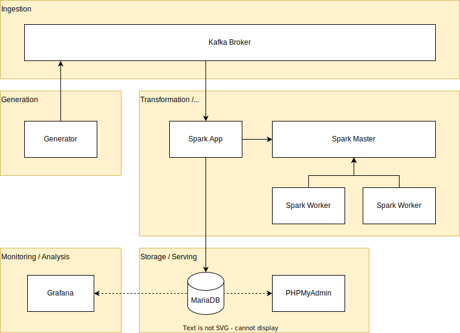

# Laborarbeit Big Data Engineering WiSe 2024/2025
> Jannis Kaniaros & Fabian Lohmüller

- [Laborarbeit Big Data Engineering WiSe 2024/2025](#laborarbeit-big-data-engineering-wise-20242025)
  - [Idea](#idea)
  - [Architecture](#architecture)
    - [Python Web Scraper + Streaming Service](#python-web-scraper--streaming-service)
    - [Apache Kafka as Message Queue](#apache-kafka-as-message-queue)
    - [Apache Spark for Data Preparation](#apache-spark-for-data-preparation)
    - [MariaDB as central storage](#mariadb-as-central-storage)
  - [Development](#development)
  - [Screencast](#screencast)


## Idea
Climate change is becoming an increasingly critical issue, with a particularly noticeable impact on wind patterns. Rising wind speeds and more frequent storms are among the significant consequences of this global phenomenon. In response to this, there is a growing need for accurate and timely wind data to better understand and predict these changes.

One solution is to develop an application that retrieves real-time wind data from the German Weather Service (Deutscher Wetterdienst, DWD). This data can then be used to generate models for more precise wind forecasts in the future. Such models would be invaluable for various sectors, including agriculture, energy, transportation, and disaster management, which are all highly sensitive to changes in wind patterns.

The DWD regularly collects and updates wind data for approximately 300 cities across Germany and makes this information publicly available through its Open Data initiative. By utilizing this open-source data, the application would allow users to access reliable and up-to-date wind information for informed decision-making. Additionally, over time, the data could be analyzed to improve predictive models, contributing to more accurate forecasting and better preparedness for extreme weather events.


## Architecture
1. Python Web Scraper + Streaming Service
2. Apache Kafka as Message Queue
3. Apache Spark for Data Preparation
4. MariaDB as central storage



### Python Web Scraper + Streaming Service
Weather and wind data is published by the German weather service (Deutscher Wetterdienst, DWD) in different time periods. The wind data used in this project is published for free as Open Data on this [URL](https://opendata.dwd.de/climate_environment/CDC/observations_germany/climate/10_minutes/wind/now/). The used dataset contains wind data, which is updated approximately every 30 minutes. The downloadable data contains the current day wind data in 10 minute intervals.


The python application `generator.py` (`generator` in docker) downloads all available files from the above-mentioned website, extracts them and merges relevant csv lines into one single file per weather station. This files can be found in the temporary folder `app/tmp/merged`. In order to avoid duplicate lines while sending - especially since the data on the website is only appended to the current-day data, the merged files contain only the lines which were not already sent by the generator. Therefore, the sent lines are stored in the folder `app/tmp/archived` and are checked during the creation of the merge files.

The downloaded and sent data contains lines in a csv format, always containing the weather station ID, the measurement date, the quality niveau (1-10), as well as `F` for the wind force and `D` for the wind direction. `eor` means `end of row`:
```csv
STATIONS_ID;MESS_DATUM;QN_3;F;D;eor
2667;2024121803;1;5.0;130;eor
```

The quality niveau is described by the DWD as following([Description of wind data](https://opendata.dwd.de/climate_environment/CDC/observations_germany/climate/10_minutes/wind/BESCHREIBUNG_obsgermany_climate_10min_wind_de.pdf)):
- QN = 1 : only formal inspection;
- QN = 2 : checked according to individual criteria;
- QN = 3 : automatic checking and correction.

### Apache Kafka as Message Queue
An Apache Kafka broker is used in the cluster as a central message queue. Two topics are used here: `jetstream` for the weather data and `jetstream-description` for the description file of the weather data (in particular, weather station information can be found here).

For reasons of simplicity, no replication is used for the Kafka Broker. The log files are also deleted after 1 gigabyte so that the disk space of the host machine is not overfilled or configuration adjustments (e.g. maximum hard disk space used) are necessary for docker.

### Apache Spark for Data Preparation
Apache Spark is used as the central technology for data processing. A Spark master and a Spark worker are first created in the cluster for this purpose. The Bitnami Spark image is used for this.

The Bitnami Spark image is also used as the base image for the Spark application, although adjustments still need to be made to make the combination of Spark, Kafka and MariaDB executable.  
For this purpose, dependencies are downloaded as JAR files and stored in the `/opt/bitnami/spark/jars/` folder. After installing the Python dependencies, the application file can then be transferred via `spark-submit` and passed to the Spark workers for processing.

In the Spark application, both Kafka topics described above are read as a stream and processed accordingly.  
First, the streams are converted into the correct format (conversion of the JSON byte array into CSV, then from CSV into usable columns). Incorrect rows, e.g. zero values in the station ID or wind speeds <= 0, are removed.

<!-- After that, aggregations take place:
- `station_aggregations_daily`: Calculation of the average wind speed and direction per weather station at daily level.
- `station_aggregations_weekly`: Calculation of the average wind speed and direction per weather station at weekly level. -->

Finally, the converted weather and station data <!-- as well as the aggregations--> are stored in the corresponding tables in MariaDB for further use.  
The converted weather data is also displayed on the console to provide an overview of whether processing is running or not.

### MariaDB as central storage
MariaDB is used for central storage. When MariaDB is initially started, all necessary databases and tables are created via an init file if they do not already exist.  
- The `stations` table contains all the information on the weather stations from the description file:  
  ```sql
  station_id bigint not null,
  von_datum timestamp not null,
  bis_datum timestamp not null,
  stationshoehe smallint, 
  geoBreite double,
  geoLaenge double,
  stationsname text,
  bundesland text,
  abgabe text
  ```
- The `wind_data` table contains all converted and filtered data. This is where the history is built up:  
  ```sql
  station_id bigint not null,
  measurement_date timestamp not null,
  quality_level tinyint,
  wind_speed double comment 'Windgeschwindigkeit in m/s', 
  wind_direction smallint comment 'Windrichtung in Grad'
  ```
<!-- - The `wind_agg` table contains all the aggregations carried out, i.e. the average wind direction and speed at daily and weekly level for each station. It is indexed accordingly to speed up searches:  
  ```sql
  id bigint not null auto_increment,
  station_id bigint not null,
  start_time timestamp not null,
  end_time timestamp not null,
  avg_wind_speed double,
  avg_wind_direction smallint
  ```-->

## Development
- Build + create container: `docker-compose build --no-cache; docker-compose up -d`
- Remove everything: `docker-compose down`
- Restart: `docker-compose down; docker-compose build; docker-compose up -d`
- Show logs: `docker logs {container}`

MariaDB:
- Open terminal in MariaDB container
- Create connection to MariaDB server: `mysql -u root -p jetstream`
- Show all databases: `show databases;`
- Select database: `use jetstream;`
- Show all tables: `show tables;`
- Queries: `select * from wind_data;`

## Screencast
