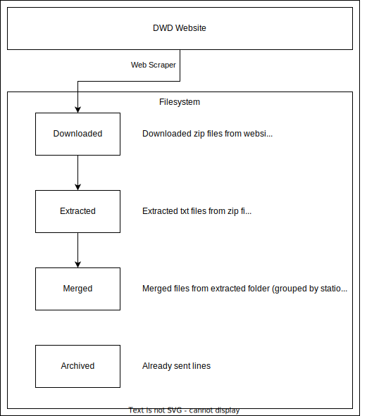
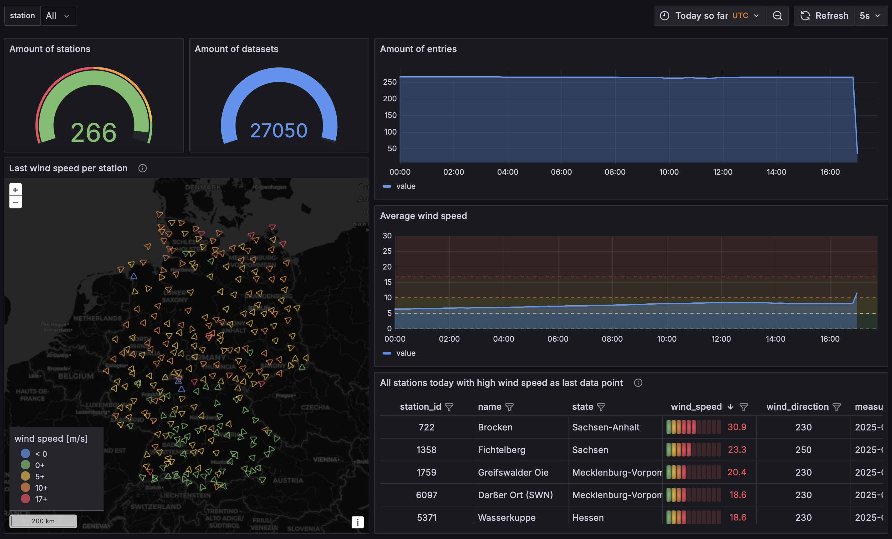

# Jetstream - German Wind Data Collector

> Laborarbeit Big Data Engineering WiSe 2024/2025  
> Jannis Kaniaros (5934448) & Fabian Lohmüller (8175324)

- [Jetstream - German Wind Data Collector](#jetstream---german-wind-data-collector)
  - [Idea](#idea)
  - [Architecture](#architecture)
    - [Python Web Scraper + Streaming Service](#python-web-scraper--streaming-service)
    - [Apache Kafka as Message Queue](#apache-kafka-as-message-queue)
    - [Apache Spark for Data Preparation](#apache-spark-for-data-preparation)
    - [MariaDB as central storage](#mariadb-as-central-storage)
    - [PHPMyAdmin as web view for MariaDB](#phpmyadmin-as-web-view-for-mariadb)
    - [Grafana for monitoring](#grafana-for-monitoring)
  - [Development](#development)
  - [Screencast](#screencast)


## Idea
Climate change is becoming an increasingly critical issue, with a particularly noticeable impact on wind patterns. Rising wind speeds and more frequent storms are among the significant consequences of this global phenomenon. In response to this, there is a growing need for accurate and timely wind data to better understand and predict these changes.

One solution is to develop an application that retrieves (almost) real-time wind data from the German Weather Service (Deutscher Wetterdienst, DWD). This data can then be used to generate models for more precise wind forecasts in the future. Such models would be invaluable for various sectors, including agriculture, energy, transportation, and disaster management, which are all highly sensitive to changes in wind patterns.

The DWD regularly collects and updates wind data for approximately 300 cities across Germany and makes this information publicly available through its Open Data initiative. By utilizing this open-source data, the application would allow users to access reliable and up-to-date wind information for informed decision-making. Additionally, over time, the data could be analyzed to improve predictive models, contributing to more accurate forecasting and better preparedness for extreme weather events.

<div style="page-break-after: always"></div>

## Architecture


### Python Web Scraper + Streaming Service
Weather and wind data are published by the German weather service (Deutscher Wetterdienst, DWD) in different time periods. The wind data used in this project is published for free as Open Data on this [URL](https://opendata.dwd.de/climate_environment/CDC/observations_germany/climate/10_minutes/wind/now/). The used dataset contains wind data, which are updated approximately every 30 minutes. The downloadable data contains the current day wind data in 10 minute intervals.



The python application [`generator.py`](generator/generator.py) (`generator` in [docker](docker-compose.yml)) downloads all available files from the above-mentioned website, extracts them and merges relevant csv lines into one single file per weather station. This files can be found in the docker container's temporary folder `/app/tmp/merged`. In order to avoid duplicate lines while sending - especially since the data on the website is only appended to the current-day data, the merged files contain only the lines which were not already sent by the generator. Therefore, the sent lines are stored in the folder `/app/tmp/archived` and are checked during the creation of the merge files.

The downloaded and sent data contain lines in a csv format, always containing the weather station ID, the measurement date, the quality niveau, as well as `F` for the wind force and `D` for the wind direction. `eor` means `end of row`:
```csv
STATIONS_ID;MESS_DATUM;QN_3;F;D;eor
2667;2024121803;1;5.0;130;eor
```
<div style="page-break-after: always"></div>

The quality niveau is described by the DWD as following (see [Description of wind data](https://opendata.dwd.de/climate_environment/CDC/observations_germany/climate/10_minutes/wind/BESCHREIBUNG_obsgermany_climate_10min_wind_de.pdf)):
- QN = 1 : only formal inspection;
- QN = 2 : checked according to individual criteria;
- QN = 3 : automatic checking and correction.

### Apache Kafka as Message Queue
An Apache Kafka broker is used in the cluster as a central message queue. Two topics are used here: `jetstream` for the weather data and `jetstream-description` for the description file of the weather data (in particular, weather station information can be found here).

For reasons of simplicity, no replication is used for the Kafka Broker. The log files are also deleted after 1 gigabyte so that the disk space of the host machine is not overfilled or configuration adjustments (e.g. maximum hard disk space used) are necessary for docker.

### Apache Spark for Data Preparation
Apache Spark is used as the central technology for data processing. A Spark master and two Spark workers are first created in the cluster for this purpose. The Bitnami Spark image is used for this. The [`docker-compose.yml`](docker-compose.yml) file is currently configured to support up to 9 workers. Additional workers require changes in the `replicas` field and range adjustments in `ports`.   
The master information is shown on port [`8080`](http://localhost:8080), whereas the worker information are shown on the ports specified in the [`docker-compose.yml`](docker-compose.yml). The default port range spans up from [`8081`](http://localhost:8081) to [`8089`](http://localhost:8089).

The Bitnami Spark image is also used as the base image for the Spark application, although adjustments still need to be made to make the combination of Spark, Kafka and MariaDB executable.  
For this purpose, dependencies are downloaded as JAR files and stored in the `/opt/bitnami/spark/jars/` folder of the `spark-app` container. After installing the Python dependencies, the application file can then be transferred via `spark-submit` and passed to the Spark workers for processing.

In the Spark application, both Kafka topics described above are read as a stream and processed accordingly.  
First, the streams are converted into the correct format (conversion of the JSON byte array into CSV, then from CSV into usable columns). Incorrect rows, e.g. null values in the station ID or wind speeds <= 0, are removed.  
Finally, the converted weather and station data are stored in the corresponding staging tables in MariaDB for further use.  
The converted weather data is also displayed on the console to provide an overview of whether processing is running or not.

<div style="page-break-after: always"></div>

### MariaDB as central storage
MariaDB is used for central storage. When MariaDB is initially started, all necessary databases, tables, procedures and events are created via an [init file](db/init.sql) if they do not already exist.  
- The `stations` table contains all the information on the weather stations from the description file:  
  ```sql
  station_id bigint not null,
  date_from timestamp not null,
  date_until timestamp not null,
  height smallint, 
  latitude double,
  longitude double,
  name text,
  state text,
  delivery text
  ```
- The `wind_data` table contains all converted and filtered data. This is where the history is built up:  
  ```sql
  station_id bigint not null,
  measurement_date timestamp not null,
  quality_level tinyint,
  wind_speed double comment 'wind speed in m/s', 
  wind_direction smallint comment 'wind direction in degree'
  ``` 

All tables have corresponding staging tables, since the data can be corrected after some time by the DWD. Those corrections would be inserted in the next iteration but fail on the insert because of the primary key constraints on the database.  
Therefore, a staging area is implemented containing no constraints. A procedure is run on the database regularly (every 5 seconds) transferring the staged data to the production tables, performing an upsert operation for colliding rows:

```sql
begin
    -- Transfer and upsert stations
    insert into stations (station_id, date_from, date_until, height, latitude, longitude, name, state, delivery)
    select s.station_id, s.date_from, s.date_until, s.height, s.latitude, s.longitude, s.name, s.state, s.delivery
    from stations_staging s
    on duplicate key update 
        date_from = values(date_from),
        date_until = values(date_until),
        height = values(height),
        latitude = values(latitude),
        longitude = values(longitude),
        name = values(name),
        state = values(state),
        delivery = values(delivery);

    -- Delete transferred rows from staging table
    delete from stations_staging ss
    where exists (
        select *
        from stations s
        where s.station_id = ss.station_id
          and s.date_from = ss.date_from
          and s.date_until = ss.date_until
          and s.height = ss.height
          and s.latitude = ss.latitude
          and s.longitude = ss.longitude
          and s.name = ss.name
          and s.state = ss.state
          and s.delivery = ss.delivery
    );

    -- Transfer and upsert wind_data
    insert into wind_data (station_id, measurement_date, quality_level, wind_speed, wind_direction)
    select w.station_id, w.measurement_date, w.quality_level, w.wind_speed, w.wind_direction
    from wind_data_staging w
    on duplicate key update 
        quality_level = values(quality_level),
        wind_speed = values(wind_speed),
        wind_direction = values(wind_direction);

    -- Delete transferred rows from staging table
    delete from wind_data_staging ws
    where exists (
        select *
        from wind_data w
        where w.station_id = ws.station_id
          and w.measurement_date = ws.measurement_date
          and w.quality_level = ws.quality_level
          and w.wind_speed = ws.wind_speed
          and w.wind_direction = ws.wind_direction
    );
end;
```

### PHPMyAdmin as web view for MariaDB
In order to be able to view the stored data, PHPMyAdmin is available on port [`8090`](http://localhost:8090).

<div style="page-break-after: always"></div>

### Grafana for monitoring
Grafana is used to create dashboards. A custom dashboard is selected by default, which can display various data. Grafana can be accessed on port [`3000`](http://localhost:3000). The default username and password is `jetstream`. The default dashboard `Jetstream` can now be selected under Dashboards on the left-hand side.


The following data are displayed here - reacting responsively to the time range selection on the top:

| **Feature** | **Description** |
|---|---|
| **Amount of stations in time range** | Shows the amount of all stations saved in the database |
| **Amount of datasets in time range**| Shows the amount of wind data entries for all stations |
| **Amount of entries over time** | Shows a time series of the amount of wind data entries for all stations |
| **Last wind speed per station** | Displays a GeoMap containing all stations. The stations are color-coded according to wind speed and oriented according to the wind direction |
| **Average wind speed** | Shows a time series of the average wind speed for all stations |
| **All stations today with high wind speed as last data point** | Shows the last wind speed for all stations which have a wind speed over 10 as their last data point (but only if the last data point is today) |




Of course, the data are changed live as soon as new data are available in the database. This happens approximately every 30 minutes because of the update cycle of the DWD.

<div style="page-break-after: always"></div>

## Development
- Build + create container: `docker-compose build --no-cache; docker-compose up -d`
- Remove everything: `docker-compose down -v`
- Restart: `docker-compose down; docker-compose build; docker-compose up -d`
- Show logs: `docker logs {container}`

MariaDB:
- Create connection to MariaDB server: 
  - Terminal: `docker exec -ti jetstream-mariadb-1 mariadb -u root -p jetstream` 
  - Attached shell to mariadb container: `mariadb -u root -p jetstream`
- Show all databases: `show databases;`
- Select database: `use jetstream;`
- Show all tables: `show tables;`
- Queries: `select * from wind_data;`

## Screencast
In the screencast all functionalities and features are shown: [Link to German screencast](https://youtu.be/FXiF89BOpgM)

<iframe width="560" height="315" src="https://www.youtube.com/embed/FXiF89BOpgM" title="YouTube video player" frameborder="0" allow="accelerometer; autoplay; clipboard-write; encrypted-media; gyroscope; picture-in-picture; web-share" referrerpolicy="strict-origin-when-cross-origin" allowfullscreen></iframe>